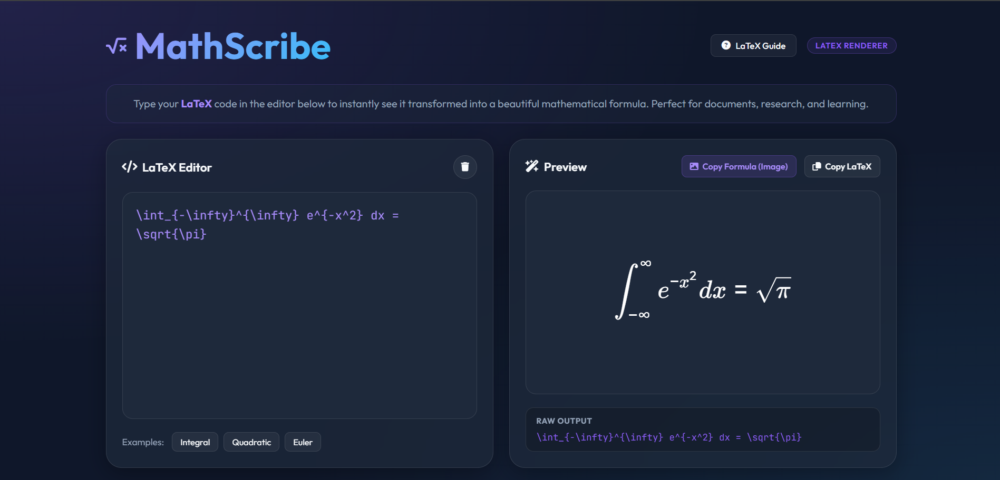
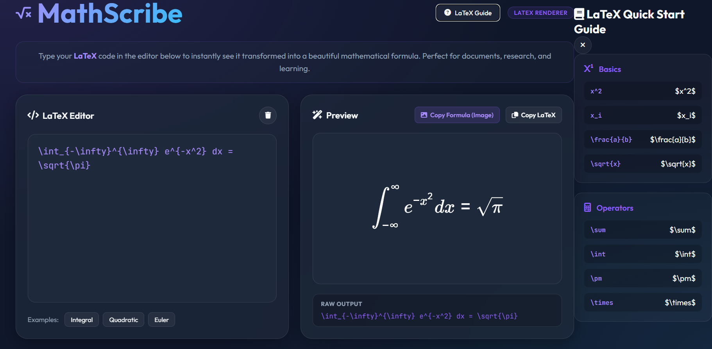

# MathScribe | Math Handwriting Recognizer

MathScribe is a modern web-based application that allows you to draw mathematical equations, formulas, and symbols on an interactive canvas and convert them into clean, copiable LaTeX code. It uses an open-source AI model (**pix2tex**) running on a local Python backend to provide fast, private, and accurate recognition without requiring any external API keys.

## 🚀 Features

- **Interactive Drawing Canvas**: Smooth drawing experience with undo and clear functionality.
- **Local AI Processing**: Uses the `pix2tex` (LatexOCR) model to process images locally.
- **Live LaTeX Preview**: Instantly renders the recognized LaTeX using KaTeX.
- **One-Click Copy**: Easily copy the generated LaTeX to your clipboard for use in documents or editors.
- **Premium Design**: Sleek dark-mode interface with glassmorphism and modern typography.

## 🛠️ Tech Stack

- **Frontend**: Vanilla HTML5, CSS3, JavaScript.
- **Math Rendering**: KaTeX.
- **Icons**: FontAwesome.
- **Backend**: Python, FastAPI, Uvicorn.
- **AI Model**: pix2tex (LatexOCR).

## 📋 Prerequisites

- Python 3.9 or higher.
- `pip` (Python package manager).

## 🔧 Installation & Setup

1. **Navigate to the project directory**:
   ```bash
   cd math-draw
   ```

2. **Install the required dependencies**:
   ```bash
   pip install -r requirements.txt
   ```
   *Note: If you encounter version issues with albumentations, ensure you are using version `1.4.24`:*
   ```bash
   pip install albumentations==1.4.24
   ```

## 🏃 Running the Application

1. **Start the local Python backend**:
   ```bash
   python backend.py
   ```
   *On the first run, the app will download the necessary AI model weights (approx. 100MB-200MB).*

2. **Open the application**:
   Once the terminal says `Uvicorn running on http://127.0.0.1:8000`, open your web browser and navigate to:
   [http://127.0.0.1:8000](http://127.0.0.1:8000)


## 📸 Screenshots

Add screenshots inside an images folder:

<p align="center">
   
</p>

<p align="center">

</p>


## 📝 Usage

1. Use your mouse or touch screen to draw an equation on the canvas.
2. Click the **"Convert to Formula"** button.
3. Wait for the AI to process the image (this takes a few seconds).
4. View the preview and copy the LaTeX code.

## 🧪 Testing

This project uses [TestGrid](https://testgrid.io) for application testing and validation to ensure a smooth and reliable user experience.

## ⚖️ License

Open Source - Feel free to use and modify!
